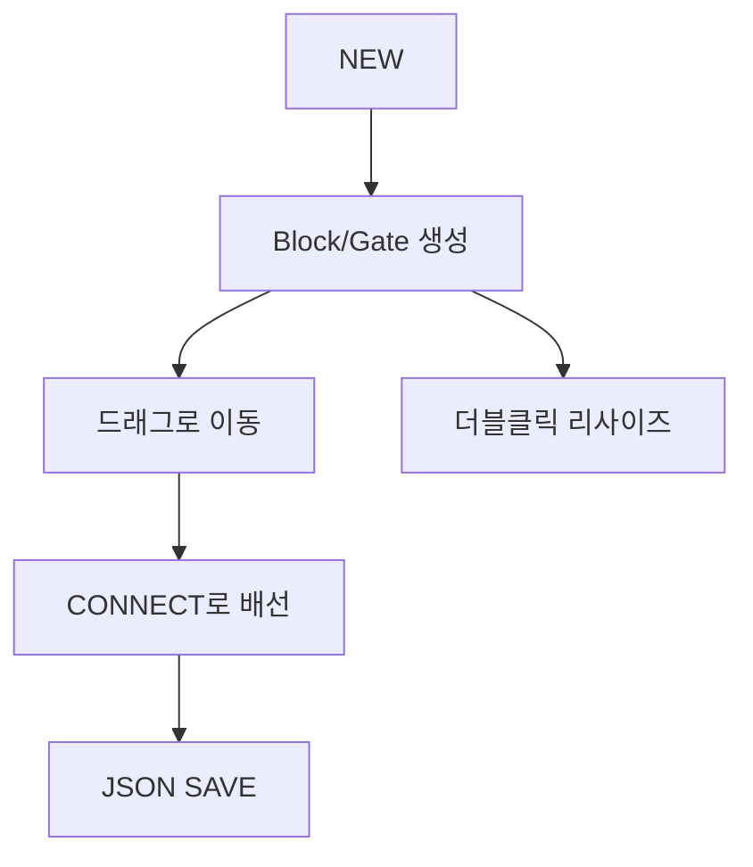

# Block Diagram Generator

`diagram.py`는 `input.json`을 읽어 디지털 회로 블록 다이어그램을 편집합니다.
블록/게이트는 드래그로 이동하며 연결선도 함께 이동합니다.
게이트는 `gate_image` 폴더의 이미지 파일을 사용해 표시됩니다.
포트 점은 반지름 5의 검정색 점으로 표시되며, 포트 이동은 5 단위로 스냅됩니다.
블록 이동 및 크기 조절은 10 단위로 스냅됩니다.



## UI 버튼 가이드

### NEW
블록/게이트를 추가합니다.
- 예시: NEW → Gate 선택 → AND2 생성

### EDIT
선택된 블록의 텍스트/색상/테두리를 편집합니다.
- 예시: 블록 클릭 → EDIT → 글꼴/색상 변경

### REMOVE
선택된 블록/게이트와 연결된 배선을 함께 삭제합니다.
- 예시: 게이트 클릭 → REMOVE

### JSON SAVE
현재 캔버스에 존재하는 블록/게이트/배선 상태를 `input.json`에 저장합니다.
- 예시: 편집 완료 → JSON SAVE

### CONNECT
서로 다른 블록/게이트의 포트를 선택해 연결선을 생성합니다.
- 예시: CONNECT → 포트 A 클릭 → 포트 B 클릭

### DISCONNECT
선택한 연결선을 삭제합니다.
- 예시: DISCONNECT → 삭제할 선 클릭

### CREATE PORT
선택한 블록의 테두리를 초록색으로 표시한 뒤, 테두리를 클릭해 포트를 추가합니다.
- 예시: 블록 클릭 → CREATE PORT → 왼쪽 테두리 클릭

### DELETE PORT
선택한 블록의 포트를 빨간색으로 표시하고, 클릭한 포트를 삭제합니다.
- 예시: 블록 클릭 → DELETE PORT → 삭제할 포트 클릭

### SHOW/HIDE PORT
포트 점 표시를 켜거나 끕니다.

### WIRE NAME
연결선을 파란색으로 표시하고, 클릭한 선에 이름을 입력합니다.

### BRING FRONT / SEND BACK
선택한 블록/게이트의 level을 이웃 level과 교환해 위/아래 레이어를 바꿉니다.

### ZOOM IN / ZOOM OUT
화면만 확대/축소합니다.

## 캔버스 동작 요약

```
[블록/게이트 더블클릭] -> 리사이즈 모드 (테두리 드래그)
[블록 드래그]        -> 이동 (10 단위 스냅)
[게이트 포트 드래그]  -> 이동 (5 단위 스냅)
```

- 게이트 리사이즈 시 테두리를 드래그하면 이미지의 서브샘플 비율이 변경됩니다.
- 오른쪽/위쪽 테두리를 드래그하면 게이트의 왼쪽 하단 좌표를 고정한 채 크기가 바뀌고, 왼쪽/아래쪽 테두리를 드래그하면 오른쪽 위 좌표를 고정합니다.
- 리사이즈 모드에서는 블록 이동과 포트 이동이 비활성화됩니다.

## 사용 방법

```bash
python diagram.py input.json diagram.png
```

기본값:
- 입력 정의: `input.json`
- 출력 이미지: `diagram.png`

PNG 저장을 위해서는 Pillow가 필요합니다.
Pillow가 없으면 PostScript(`diagram.ps`)만 생성됩니다.

## 입력 정의 (input.json)

```json
{
  "blocks": [
    {
      "name": "BlockA",
      "kind": "BLOCK",
      "x": 80,
      "y": 80,
      "width": 160,
      "height": 100,
      "level": 0,
      "fill_color": "WHITE",
      "outline_color": "GRAY",
      "outline_enabled": true,
      "outline_thickness": 1.0,
      "outline_style": "solid",
      "font_size": 12,
      "font_family": "Arial",
      "font_weight": "bold",
      "ports": {
        "p1": {
          "side": "left",
          "offset": 0.33
        },
        "p2": {
          "side": "right",
          "offset": 0.5
        }
      }
    }
  ],
  "connections": [
    {
      "src": "BlockA.out1",
      "dst": "BlockB.in1",
      "label": "net1"
    }
  ],
  "wires": [
    {
      "src": "BlockA.out1",
      "dst": "BlockB.in1",
      "manual_mid_x": 200,
      "manual_mid_y": null
    }
  ]
}
```

블록/게이트는 `blocks`에 정의하며, `connections`는 논리 연결을 정의합니다.
`wires`에는 연결선의 꺾임 지점(`manual_mid_x`, `manual_mid_y`)과 같은 시각적 정보를 저장합니다.
포트 위치를 고정하려면 `ports` 아래에 각 포트 이름을 키로 두고 `side`, `offset`, `manual_y`를 지정합니다.
`fill_color`/`outline_color`에는 `GRAY`, `BLUE`, `RED`, `WHITE`처럼 이름 문자열을 넣으면 해당 색상이 적용됩니다.
`outline_enabled`를 false로 두면 테두리가 그려지지 않습니다.
`outline_thickness`는 0.5(Thin)/1.0(Normal)/2.0(Thick)로 저장됩니다.
`outline_style`은 `solid` 또는 `dashed`를 사용합니다.
`font_size`는 블록 이름 글꼴 크기를 의미합니다.
`font_family`는 `Arial` 또는 `Malgun Gothic`을 선택할 수 있고, `font_weight`는 `bold` 또는 `normal`입니다.
연결에 사용되지 않은 포트가 있으면 `error.log`에 기록됩니다.
포트 이동은 5 단위로 스냅됩니다.
